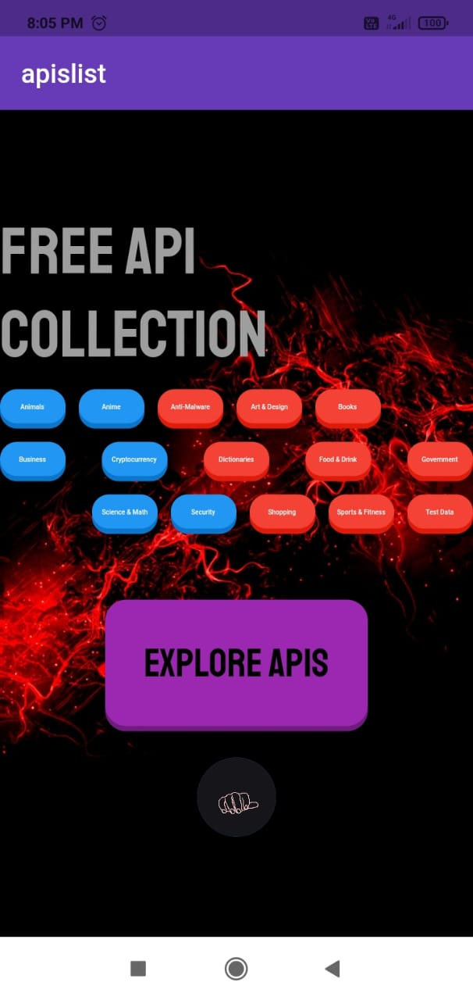
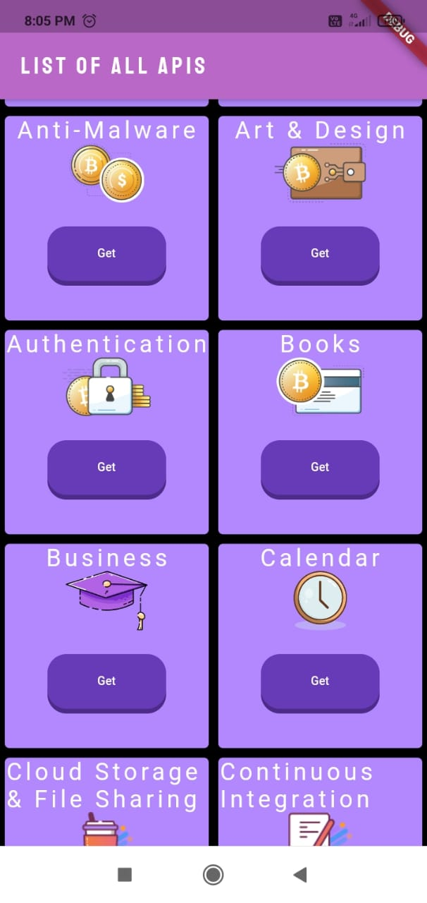
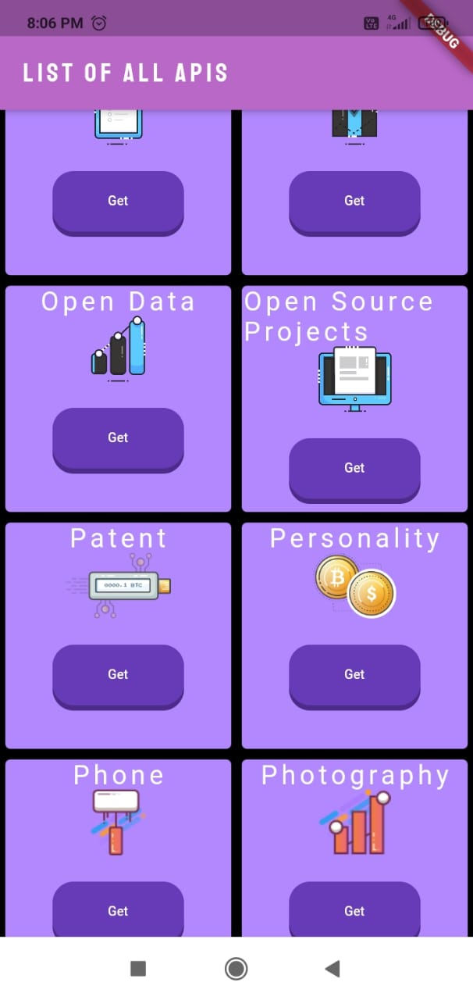
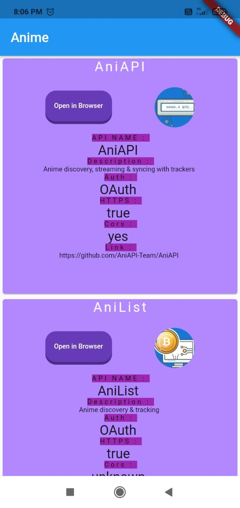
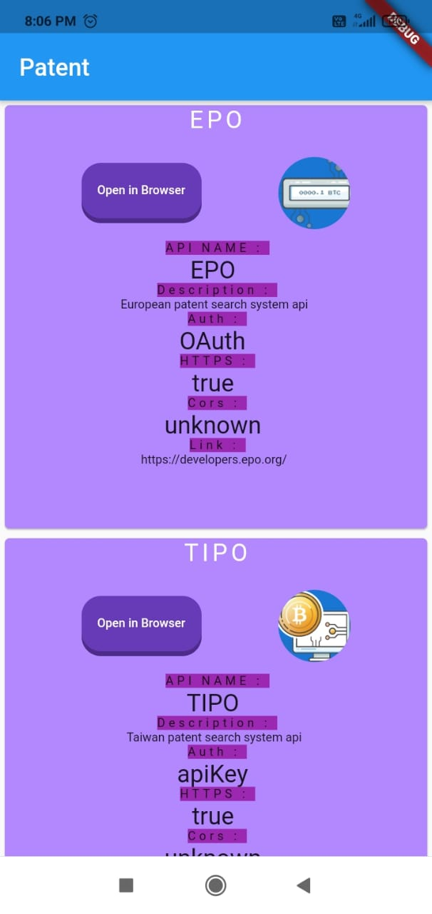

# Api-Collection-App-Using-Flutter-

## About 🦖
***This  app  contains all kind of free apis that are available for developer for making projects. This project is made using flutter.***
<!-- Place this tag where you want the button to render. -->
## API Data ⚡
Link for the api : ⛏
https://api.publicapis.org/
Example response 💣:-
```
"count": 28,
    "entries": [
        {
            "API": "arcsecond.io",
            "Description": "Multiple astronomy data sources",
            "Auth": "",
            "HTTPS": true,
            "Cors": "unknown",
            "Link": "https://api.arcsecond.io/",
            "Category": "Science & Math"
        },
        ]

```


# Mobile APP 🌟
### ScreenShots :🔥
<div display="flex">
 </img>
 </img>
 </img>
 </img>
 </img>
</div>

### Preview : 🔥


<div display="flex" justify-content="center">
  <h1> Thanks ✍ </h1>
 </div>

